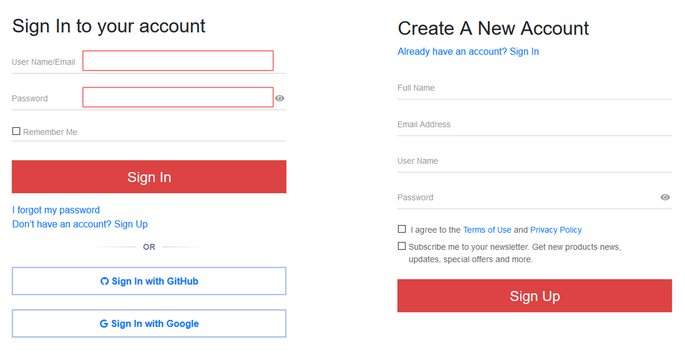
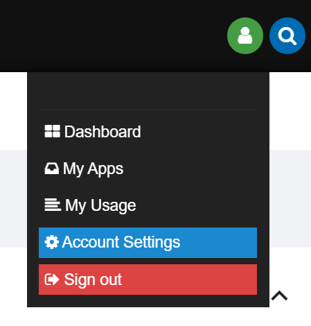
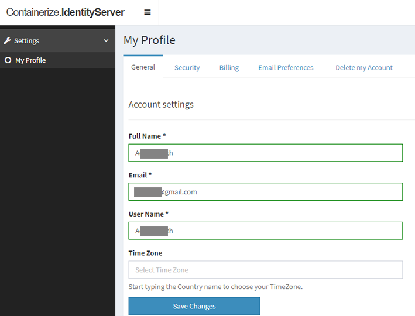
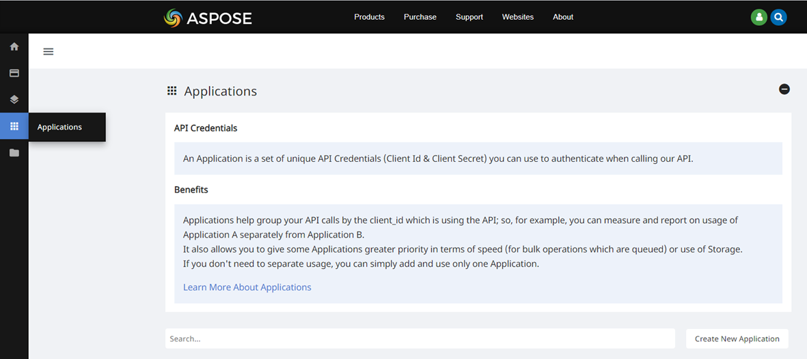
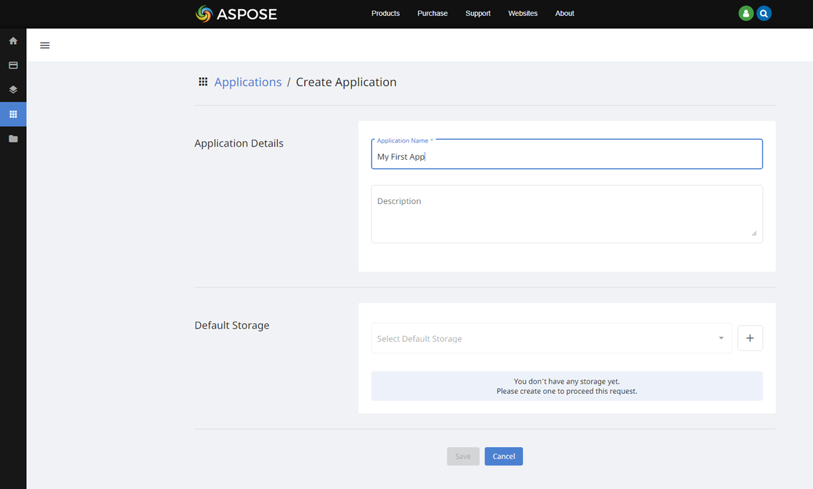
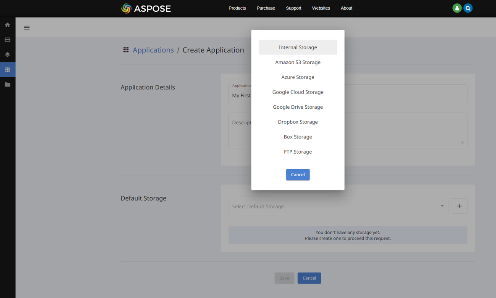
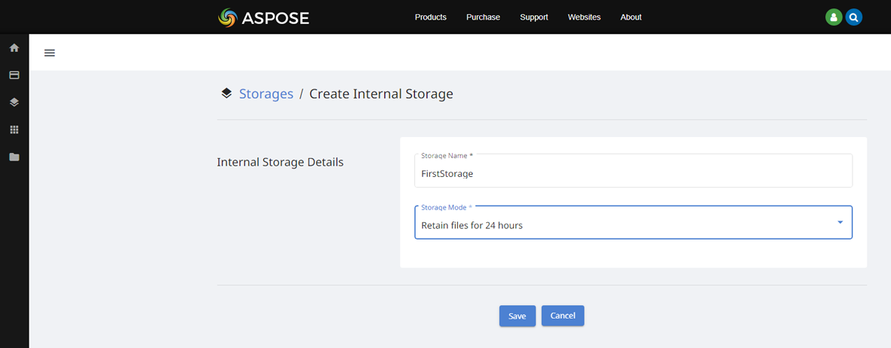
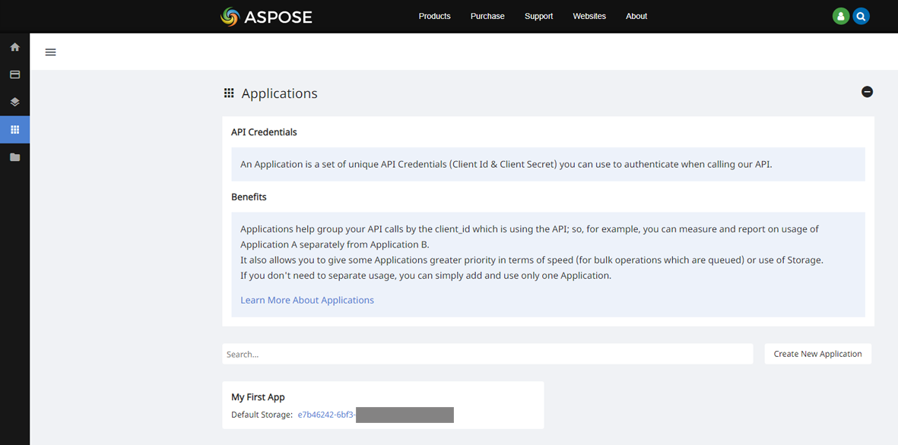
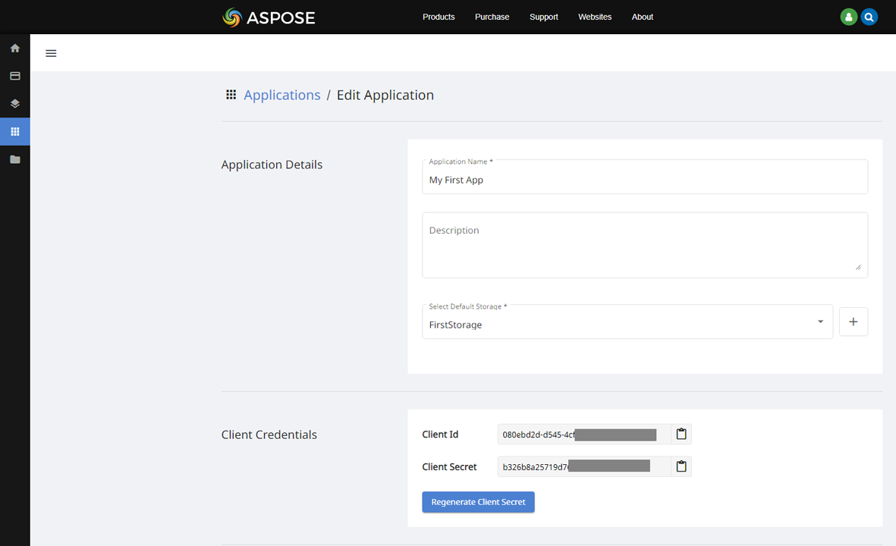

It is quite easy to use Aspose.HTML for Cloud in your projects. But before you start, you need to create an **Aspose Cloud Account** and obtain **Client Id** and **Client Secret**.

## **1. Create a Free Account**
Please go to <https://dashboard.aspose.cloud/#/> to create a free **Aspose Cloud Account**. You will be redirected to Single Sign On application to authenticate to our services.

If you already have an account with our services, please specify the User Name/Email and Password and click on the Sign In button. If you don’t have an account with our services, click on the **Don’t have an account? Sign Up** button or Sign In using an existing GitHub or Google account.
Please, provide the required information in the **Create A New Account** form in order to setup your account. 

The following figure shows the online forms for Sign In and Sing Up:



You will be redirected to the Dashboard after the account is created.

## **2. Manage Your Account**

You can view and update your Account details. For this, you need to access your Aspose Account Settings by clicking the icon in the upper-right corner of the page. Select the **Account Settings** item from the menu bar. 




Next, in **My Profile**, you can choose **General**, **Security**, **Billing**, etc., for editing and setting. Make your settings and click the **Save Changes** button to confirm.



## **3. Create New App and Default Storage**

Aspose appoints excellent importance to security concerns. We use the JWT token for the authentication and end-to-end HTTPS encryption to secure all client-server interactions. You should use a set of unique API **Credentials** (Client Id & Client Secret) to authenticate when calling Aspose Cloud API.

1. Before you can make any requests to Aspose Cloud APIs you need to create an API client application. For this, log into the [Dashboard](https://dashboard.aspose.cloud/), access the **Applications** page and click on the **Create New Application** button. For more detailed information see the [Creating and Managing Application](https://docs.aspose.cloud/total/getting-started/dashboard/creating-and-managing-application/) article.





2. Next, you will be redirected to the page shown on the followed figure. You can enter an **Application Name** and Description for a new Application.





3. You should click on the "**+**" button next to the default storage select box field for the storage creation. Select in the drop-down menu the kind of storage. Obey the instructions on the [Creating and Managing Storages](https://docs.aspose.cloud/total/getting-started/dashboard/how-to-configure-3rd-party-cloud-storages/) page to set up your first storage.




4. If you choose the **Internal Storage**, give the **Storage Name**, select the **Storage Mode** and push the **Save** button. You will be redirected to the Applications Page.
   The newly created storage will be pre-selected on the Default Storage field since it’s the single storage you have. 




## **4. Get Your  Client Id and Client Secret**

1. Go back to the **Applications** page. At the bottom of the page, you find the **My First App**. Click this link to view and update your security credentials. 



2. Each Application has its own **Client Id** and **Client Secret**. These security credentials allow you to authenticate Aspose.HTML API calls.



3. You have successfully received your security credentials. 

{} 
**Note:** If you, working with Aspose Cloud, come across the terms **App SID** and **App key (secret key)**, they should be interpreted as **Client Id** and **Client Secret** respectively.
{} 


## **5. Install the SDK of Your Choice**
Aspose.HTML for Cloud SDK is written in different languages; all you need to get started is to add our SDK to your existing project. Download Cloud SDK of your required platform as explained below:





```java

// Install Aspose.HTML Cloud SDK via NuGet

PM> Install-Package Aspose.Html-Cloud              

```





```java
pip install -r Aspose.Html-Cloud-SDK-for-Python/requirements.txt
python Aspose.Html-Cloud-SDK-for-Python/setup.py install
```





```java

To install the API client library to your local Maven repository, simply execute:

mvn install

```





```java

Composer:

To install the bindings via Composer, add the following to composer.json:

{
  "repositories": [
    {
      "type": "git",
      "url": "https://github.com/aspose-html-cloud/aspose-html-cloud-php.git"
    }
  ],
  "require": {
    "aspose-html-cloud/aspose-html-cloud-php": "\*@dev"
  }
}

Then run composer install

Manual Installation:


Download the files and include autoload.php:

require_once('/path/to/aspose-html-cloud-php/vendor/autoload.php');


```





```java

bundle install --jobs 4

Build a gem:

To build the Ruby code into a gem:

gem build aspose_html.gemspec

Then either install the gem locally:

gem install ./aspose_html-1.0.0.gem

```





```java

To use the library locally without publishing to a remote npm registry, first install the dependencies by changing into the directory containing package.json (and this README). Let's call this JAVASCRIPT_CLIENT_DIR. Then run:

npm install

Next, link it globally in npm with the following, also from JAVASCRIPT_CLIENT_DIR:

npm link

Finally, switch to the directory you want to use your asposehtmlcloud from, and run:

npm link /path/to/<JAVASCRIPT_CLIENT_DIR>

You should now be able to require('asposehtmlcloud') in javascript files from the directory you ran the last command above from.

```





```java
Loading from GIT


git clone https://github.com/aspose-html-cloud/aspose-html-cloud-cpp.git
cd aspose-html-cloud-cpp

```





```java

pip install -r Aspose.Html-Cloud-SDK-for-Python/requirements.txt
python Aspose.Html-Cloud-SDK-for-Python/setup.py install

```





```java

Clone the GitHub repository and import the project into your workspace

```





```java

Building the API client library requires the Gradle Build Tool to be installed.
To build the API client library, simply execute:

gradlew.bat

```



